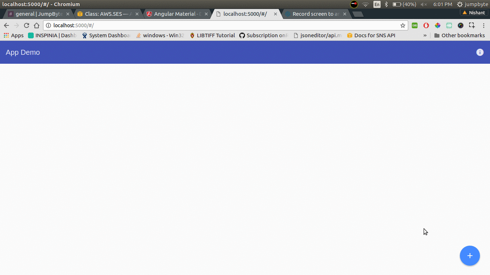

# angular2-trello
A simple demo app like Trello using Angular Material

## Setup
1. `git clone https://github.com/jumpbytehq/angular2-trello-material`
2. `npm install`

## Directions to use
2. start app using `npm run server`

## Demo
